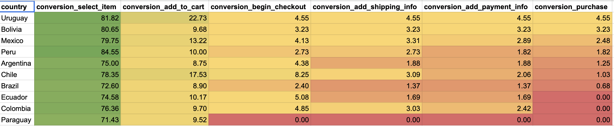
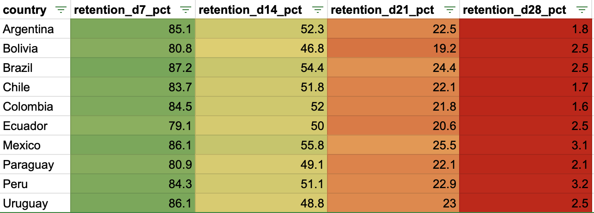
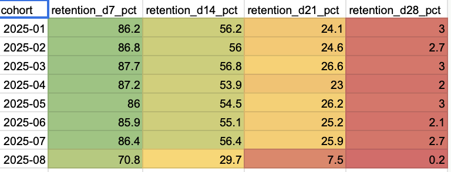

# Funnel & Retention Analysis — MercadoLibre (SQL)

## Overview
This project analyzes the **conversion funnel and user retention** for MercadoLibre from a **product growth and retention** perspective.  
The goal is to identify **where users drop off**, understand **retention behavior over time**, and propose **actionable, data-driven improvements**.

The analysis was performed using **SQL**, focusing on funnel modeling, country-level segmentation, and cohort-based retention.

---

## Business Questions
- Where do users drop off the most across the purchase funnel?
- How do conversion rates vary by **country**?
- How well are users retained over time (D7, D14, D21, D28)?
- Is the retention problem local (by country) or structural?

---

## Key Insights

### 🔻 Funnel
- The **largest drop-off occurs between `select_item` and `add_to_cart`** across all countries.
- The main friction happens **before checkout**, pointing to issues in **purchase decision-making**, not payment.
- Uruguay and Chile perform relatively better, while Brazil, Argentina, and Peru show higher friction.
- Paraguay shows a complete funnel break after checkout (likely data or offer issues).

📌 **Implication:**  
If users do not add items to the cart, they rarely convert **and** are unlikely to return.

---

### 🔁 Retention
- **Strong early activation:** D7 retention is above **80%** across all countries.
- **Sharp drop after two weeks:** the biggest decline happens between **D14 and D21**.
- **Very low D28 retention (≈2–3%)** across all countries.

📌 **Implication:**  
MercadoLibre activates users well, but struggles to build **long-term usage habits**.

---

### 📅 Cohort Analysis
- Retention patterns are **consistent across monthly cohorts**.
- Confirms the issue is **systemic**, not tied to a specific country or time period.

---

## Recommendations
1. **Prioritize the `select_item → add_to_cart` stage**
   - Improve price clarity and perceived value  
   - Show shipping costs earlier  
   - Strengthen trust signals (reviews, seller reputation)

2. **Improve post-purchase retention (D14–D28)**
   - Introduce return triggers (alerts, recommendations, follow-ups)
   - Reinforce value after the first purchase

3. **Validate with A/B testing**
   - Measure not only conversion uplift, but also impact on retention and user quality

---

## Visual Highlights

### Funnel Conversion by Country

### Retention by Country (D7–D28)

### Cohort Retention Heatmap

---

## Tools & Skills
- **SQL** (CTEs, funnel modeling, cohort analysis)
- Data aggregation & segmentation
- Product & growth analytics
- Business insight communication

---

## Takeaway
This project demonstrates the ability to:
- Translate **product growth questions into SQL analysis**
- Build **multi-step funnels**
- Analyze **retention and cohorts**
- Deliver **clear, actionable recommendations** for product teams
